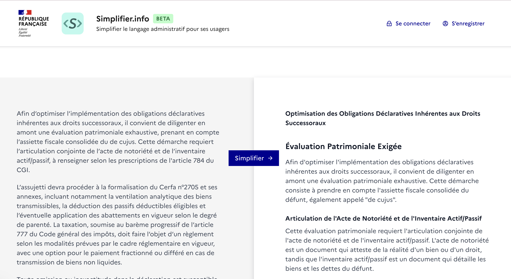

# GenAI for Public Good

<div align="center">
  
</div>

## Description

Ce repo contient les sources de la soumission de [Réfugiés.info](https://refugies.info/fr) dans le cadre du Hackathon [GenAI for Public Good](https://alliance.numerique.gouv.fr/hackathon/ai-action-summit/) du 5-6 février 2025.

Il est organisé de la manière suivante:

| Répertoire  | Description                                                                  |
| ----------- | ---------------------------------------------------------------------------- |
| `apps`      | Les applications                                                             |
| `data`      | Datasets et données traitées                                                 |
| `docs`      | Documentation et documentation technique                                     |
| `images`    | Images et ressources graphiques utilisées dans le projet                     |
| `models`    | Modèles de langue et scripts liés aux modèles                                |
| `notebooks` | Notebooks Jupyter pour l'analyse des données et le développement des modèles |
| `packages`  | Packages et bibliothèques réutilisables                                      |
| `scripts`   | Scripts utilitaires pour le traitement des données et l'automatisation       |

C'est un monorepo hybride (node + python). Les applications node utilisent `pnpm` et `turbo`, les applications python utilisent `uv`.

## Participants

- Luis Arias - EIG et CTO de Réfugies.info
- Nour Allazkani - Chef de projet de Réfugies.info
- Alice Mugnier - Responsable éditoriale de Réfugiés.info
- Claudia Meleghi - Rédactrice pôle éditoriale
- Marianne Georges - Product manager de Réfugiés.info
- Margot Gillette - Designer chez Réfugiés.info
- Jérémie Gisserot - Développeur Front-End chez Réfugiés.info
- Alexandre Bigot - Data scientist à la SDID / DTNUM / MI
- Nouran Khallaf - NLP Post-doctoral research fellow à l'université de Leeds

## Applications

### Simplifier.gouv.fr

<div align="center">
  
</div>

L'application web de [Simplifier.gouv.fr](https://simplifier.gouv.fr) est une application [NextJS 14](https://nextjs.org/) qui utilise le [AI SDK de vercel](https://sdk.vercel.ai/) pour fournir une interface utilisateur simple et intuitive pour la simplification de textes administratifs. L'application utilise des prompts optimisés entrainés sur une dataset de textes parallèles élaborée et annotée par le pôle éditorial de [Réfugiés.info](https://refugies.info). La dataset a été anonymisée pour obfusquer toute [donnée personnelle (PII)](https://fr.wikipedia.org/wiki/Donn%C3%A9es_personnelles)

L'application utilise [l'IA d'état Albert API](https://github.com/etalab-ia/albert-api) et nécessite d'avoir une clé API.

## Modèles

Le répertoire `models` contient un modèle permettant de prédire les strategies de simplification d'un texte. Il a été fine-tuné sur la dataset.

## Notebooks

### Data Cleaning

Trois étapes sont nécessaires pour nettoyer les données :

- [Filtrage](notebooks/data_cleaning/1.%20Filter.ipynb) : nous avons conservé des transformations de texte qui ne sont pas pertinentes pour la classification dans notre dataset d'origine. Il fallait donc filtrer ces lignes de la dataset.
- [Anonymisation](notebooks/data_cleaning/2.%20Process%20PII.ipynb) : malgré que la dataset provient de données publiques disponbiles en libre accès sur le site Réfugiés.info, pour les besoins du hackathon, nous avons besoin de supprimer toute donnée personnelle (PII). Nous avons donc anonymisé les textes.
- [Categorisation](notebooks/data_cleaning/3.%20Categorization.ipynb) : L'annotation de la dataset a été effectué sur un niveau plus précis que les grands catégories de notre taxonomie. Cependant, dans l'intérêt de réduire le nomre de catégories, nous avons regroupé les lignes dans la dataset dans les catégories de notre taxonomie.

### Data Exploration

- [Data Exploration](notebooks/data_exploration/explore-data.ipynb)

### Fine-tuning

Nous avons fine-tuné mBERT pour la tâche de prédiction des strategies de simplification à partir des textes à simplifier.

- [Category Classifier](notebooks/fine_tuning/Categorie_Classifier.ipynb)
- [Fine Tuning Multi Label](notebooks/fine_tuning/finetune-mutlilabel.ipynb)
- [MultiLabel Text Classification](notebooks/fine_tuning/MultiLabel_Text_Classification.ipynb)

### Prompt Optimisation

- [Prompt Optimisation](notebooks/prompt_optimisation/Prompt_Optimisation.ipynb) : Utlisation de TextGrad intégrant notre modèle finetuné mBERT pour optimiser le prompt utilisé par l'application Simplifier.info.

## Installation

### Python

Ce répo utilise python 3.12.8 et `uv` pour l'installation et la gestion des environnements virtuels. Installer `uv` en suivant les [instructions pour
votre système d'exploitation](https://docs.astral.sh/uv/getting-started/installation/).

Ensuite créer l'environment virtuel et installer les dépendances avec : `uv sync`

### Node

Ce repo utilise `volta` pour l'installation des dépendances. Installer `volta` en suivant les [instructions pour
votre système d'exploitation](https://docs.volta.sh/guide/getting-started).

Ensuite installer les dépendances avec :

```
volta install node@22.13.1
volta install pnpm@10.2.0
pnpm install
```

## Variables d'environnement

Pour pouvoir faire tourner l'application Simplifier.info localement, il faut créer un fichier `.env.local` dans le répertoire `apps/client` dans lequel il faut ajouter les variables suivantes :

- `ALBERT_API_KEY` : Clé API de l'IA d'état Albert API

## Développement

Pour faire tourner l'application Simplifier.info localement, il faut exécuter la commande suivante:

```
turbo dev
```

## Data

La dataset utilisée pour le fine-tuning et le prompt optimisation est disponible dans le répertoire `data/` et a le format suivant:

| Version initiale                                                                                                                                                        | Version retraitée                                                                                                                                                                                                       | Catégorie     |
| ----------------------------------------------------------------------------------------------------------------------------------------------------------------------- | ----------------------------------------------------------------------------------------------------------------------------------------------------------------------------------------------------------------------- | ------------- |
| Dispositif d'apprentissage du français : permet de gagner en autonomie au quotidien grâce à des ateliers sociolinguistiques et cours de français langue professionnelle | Des ateliers 2 fois par semaine pour progresser en français, mieux communiquer au quotidien et dans le milieu professionnel. Bon à savoir Une adhésion de 15 € / an à l'association est demandée lors de l'inscription. | Explanation   |
| Dispositif d'apprentissage du français : permet de gagner en autonomie au quotidien grâce à des ateliers sociolinguistiques et cours de français langue professionnelle | Des ateliers pour progresser en français, mieux communiquer au quotidien et dans le milieu professionnel.                                                                                                               | Substitution  |
| Dispositif d'apprentissage du français : permet de gagner en autonomie au quotidien grâce à des ateliers sociolinguistiques et cours de français langue professionnelle | Des ateliers pour progresser en français, mieux communiquer au quotidien et dans le milieu professionnel.                                                                                                               | Compression   |
| Dispositif d'apprentissage du français : permet de gagner en autonomie au quotidien grâce à des ateliers sociolinguistiques et cours de français langue professionnelle | Des ateliers pour progresser en français, mieux communiquer au quotidien et dans le milieu professionnel.                                                                                                               | Syntactic     |
| Progresser en français                                                                                                                                                  | Progresser en français                                                                                                                                                                                                  | Transcription |

# Taxonomie

La taxonomie suivante permet d'annoter les phrases selon les transformations qui ont été effectuées par l'équipe éditoriale Réfugies.info. Notre taxonomie est inspirée par celle figurant dans les travaux de Nouran Khallaf et notamment son article ["Reading between the lines: A dataset and a study on why some texts are tougher than others"](https://arxiv.org/abs/2501.01796v1).

| Catégorie     | Description                                                                                                                                                   |
| ------------- | ------------------------------------------------------------------------------------------------------------------------------------------------------------- |
| Transcription | On a conservé la phrase telle qu'elle                                                                                                                         |
| Synonymy      | La phrase a le même sens, mais on en a changé la grammaire simple et le vocabulaire                                                                           |
| Explanation   | Explication de mots culturels, du contexte français, de concepts etc = explanation<br>Donner des exemples = examples<br>Ajout d'une info exogène = complement |
| Omission      | On enlève des éléments (mots, phrases...)                                                                                                                     |
| Compression   | Simplification de construction grammaticale (phrases passives en actives, changement de temps)                                                                |
| Modulation    | Changement de perspectives (passage de la 3e personne à la 2e personne "vous")                                                                                |
| Transposition | Changer une catégorie grammaticale de la phrase sans changer le message                                                                                       |
| Syntactic     | Passage au bullet point par exemple, simplification syntaxique (une phrase avec "." qui devient plus courte, les / qui deviennent "et" ou des virgules)       |

## Recommendations

- [Conventional Commits](https://www.conventionalcommits.org/en/v1.0.0/)

## Scripts utiles

- `pnpm clean:branches` : Nettoyer les branches supprimées de github
